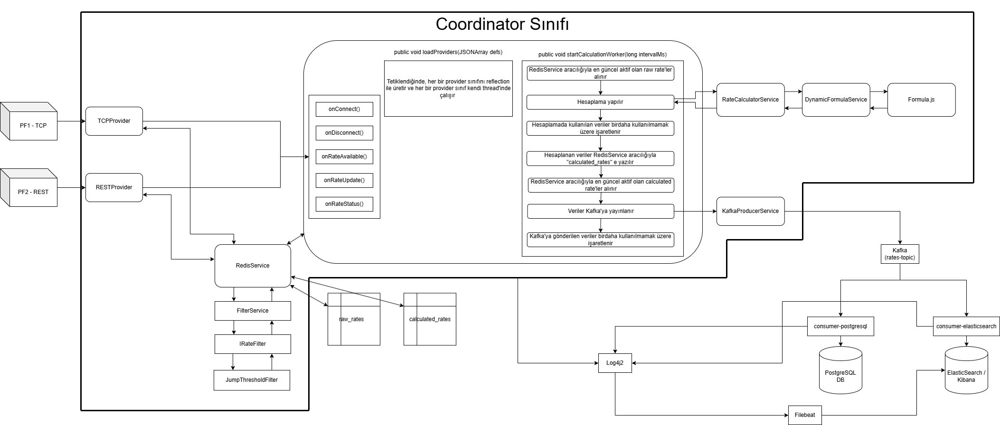

# Toyota 32bit Project

Bu proje; çoklu platformlardan (TCP & REST) döviz kuru verilerini toplayan, filtreleyen, dinamik JavaScript ile hesaplayan ve sonuçları Kafka üzerinden PostgreSQL ve Elasticsearch'e aktaran, gerçek zamanlı, mikroservis tabanlı bir backend çözümüdür.
Veri işleme, Redis üzerinde aktif/pasif veri yönetimiyle yapılır ve merkezi loglama & izleme için Log4j2 + Filebeat + Kibana kullanılır.


---

## 🛠️ Kullanılan Teknolojiler

- **Java**
- **Spring Boot**
- **Redis & Redis Stream**
- **Apache Kafka**
- **PostgreSQL**
- **ElasticSearch & Kibana**
- **Log4j2 + Filebeat**
- **Docker & Docker Compose**
- **Javascript**

---

## 🧱 Proje Mimarisi


Mimari bileşenler:
- `TCPProvider`, `RESTProvider`: Farklı kaynaklardan veri toplar
- `RedisService`: Ara bellek yapısı (Redis) ile iletişime geçer
- `FilterService`: Gelen verileri anomaliye karşı denetler.
- `RateCalculatorService + DynamicFormulaService + Formula.js`: Hesaplama akışı
- `KafkaProducerService`: Hesaplanan verileri Kafka'ya gönderir
- `consumer-postgresql`, `consumer-elasticsearch`: Kafka'dan veri okuyup veritabanlarına yazar
- `Log4j2 + Filebeat`: JSON loglama ve merkezi izleme
---

## 🚀 Kurulum

1. **Repository'yi klonlayın:**

```bash
git clone https://github.com/Ali-Kerem-Kol/Toyota-32bit-Project.git
cd Toyota-32bit-Project
```

2. **Docker ile çalıştırın:**

```bash
docker-compose up --build
```

## ⚙️ Konfigürasyon Dosyaları Açıklamaları

| Dosya Yolu | Açıklama |
|------------|----------|
| `Main/coordinator/config/config.json` | Ana **Coordinator** yapılandırması: Redis & Kafka bağlantı bilgileri, aktif filtre listesi, `Formula.js` dosya yolu vb. |
| `Main/coordinator/config/rest-config.json` | **RESTProvider** parametreleri |
| `Main/coordinator/config/tcp-config.json` | **TCPProvider** parametreleri |
| `Main/coordinator/config/jumpThresholdFilter.json` | **JumpThresholdFilter** parametreleri |
| `Servers/RESTServer/config/config.json` | **RESTServer**’ simülasyon parametreleri |
| `Servers/TCPServer/config/config.json` | **TCPServer** simülasyon parametreleri |
| `Consumers/consumer-postgresql/src/main/resources/application.properties` | **consumer-postgresql** Spring Boot ayar dosyası – PostgreSQL, Kafka bilgisi. |
| `Consumers/consumer-elasticsearch/src/main/resources/application.properties` | **consumer-elasticsearch** Spring Boot ayar dosyası – Elasticsearch, Kafka bilgisi. |
| `filebeat.yml` | Filebeat giriş/çıkış ayarları: Log yolları ve Elasticsearch hedefi. |


---

## 📂 Klasör Yapısı

```
Toyota32bitProje/
│
├── Project/
│   ├── Consumers/
│   │   └── consumer-elasticsearch
│   │   └── consumer-postgresql
│   ├── Main/
│   │   └── coordinator
│   ├── Servers/
│   │   └── RESTServer
│   │   └── TCPServer
│   ├── docker-compose.yml
│   └── filebeat.yml
│
├── Proje Teknik Dokümanı V0.1.docx
├── Mimari.png
```

## 💡 Kısa Akış Özeti

1. **Veri Sağlayıcılar (TCPProvider & RESTProvider)**
   - Farklı platformlardan gerçek zamanlı döviz kuru verileri toplar.
   - Veriler filtrelenir ve Redis’e (raw_rates) gönderilir.

2. **Coordinator (Ana Uygulama)**
   - Redis'ten en güncel aktif raw rates'leri çeker.
   - Hesaplamalar yapılır ve kullanılan veriler tekrar kullanılmamak üzere pasiflenir.
   - Hesaplanan veriler Redis’te calculated_rates olarak saklanır.
   - Redis'ten en güncel aktif calculated rates'leri çeker.
   - Sonuçlar Kafka’ya gönderilir ve kullanılan veriler tekrar kullanılmamak üzere pasiflenir.

3. **Kafka**
   - Hesaplanan verileri ilgili tüketici servislere dağıtır.

4. **Consumer-PostgreSQL & Consumer-Elasticsearch**
   - Kafka’dan gelen verileri kendi veritabanına (PostgreSQL, Elasticsearch) yazar.

5. **Loglama & İzleme**
   - Tüm servisler Log4j2 ile JSON formatında log tutar.
   - Filebeat, logları merkezi olarak Elastic/Kibana’ya yönlendirir.


---

# 🧠 Redis (Raw & Calculated Rate İzleme)

Uygulama, veri önbellekleme ve pasif/aktif yönetim işlemlerini `Redis` üzerinden yürütür. Redis içerisinde iki ana stream kullanılır:

- `raw_rates`: Platformlardan gelen ham veriler (aktif/pasif olarak işaretlenmiş)
- `calculated_rates`: Hesaplama motorundan çıkan sonuçlar (aktif/pasif olarak işaretlenmiş)

### 🔌 Redis'e Bağlanmak

Redis'e CLI üzerinden bağlanmak için:

```bash
docker exec -it redis redis-cli
```

Verileri görmek için örnek komutlar:
```bash
LRANGE raw_rates:TCP_PLATFORM:EURUSD 0 10
LRANGE calculated_rates:EURTRY 0 10
```
Pasif hale getirilen veriler isActive=false olarak işaretlenir.


# 🗃️ PgAdmin (PostgreSQL Arayüzü)

Kafka’dan gelen hesaplanmış veriler, `consumer-postgresql` servisi tarafından PostgreSQL veritabanına yazılır. Bu verileri incelemek için web arayüzü olan **PgAdmin** kullanılabilir.

### 🌐 Erişim Bilgileri

- **URL:** http://localhost:8083
- **E-posta:** `admin@admin.com`
- **Şifre:** `admin`

### 🗄️ Bağlantı Kurulumu

PgAdmin arayüzüne girdikten sonra veritabanına bağlanmak için aşağıdaki adımları izleyin:

1. Sol üstten **"Servers > Register > Server..."** seçeneğini tıklayın.
2. **General sekmesinde:**
   - **Name:** `postgres-db`
3. **Connection sekmesinde:**
   - **Host name/address:** `postgres-db`
   - **Port:** `5432`
   - **Username:** `postgres`
   - **Password:** `1234`

4. Kaydettikten sonra sol menüde `exchange_rates` adlı veritabanını göreceksiniz.
   - İçerisinde `tbl_rates` tablosu yer alır.
   - Bu tabloda hesaplanmış döviz kuru verileri yer alır.

PgAdmin sayesinde gelen verilerin doğruluğunu manuel olarak kontrol edebilirsiniz.


# ⚙️ Yapılandırma Dosyaları

## 📁 `Main/coordinator/config/config.json`
Ana uygulamanın tüm konfigürasyonlarını içerir:

- **Veri sağlayıcılar:** `TCPProvider`, `RESTProvider`
- **Hesaplama:** JavaScript dosyası üzerinden dinamik hesaplama (`Formula.js`)
- **Kafka ayarları:** Broker adresi, topic adı, retry/reinit değerleri
- **Redis cache ayarları:** TTL, max liste boyutu
- **Filtre tanımları:** `JumpThresholdFilter` filtresi platform-bazlı tanımlıdır

> Örnek:
```json
"subscribeRates": ["USDTRY", "EURUSD", "GBPUSD"],
"formulaFilePath": "/app/Main/coordinator/scripts/Formula.js",
"redis": {
  "host": "redis",
  "port": 6379,
  "ttlSeconds": 10,
  "maxListSize": 10
}
```

---

## 🌐 Sağlayıcı Platform Konfigürasyonları

### 📄 `tcp-config.json`
TCP sunucusuna bağlanacak host ve port bilgileri:

```json
{
  "host": "tcp-server",
  "port": "5000"
}
```

### 📄 `rest-config.json`
REST sunucusunun API endpoint’i ve API anahtarı:

```json
{
  "restApiUrl": "http://rest-server:8081/api/rates",
  "apiKey": "xxxxxxxx-xxxx-xxxx-xxxx-xxxxxxxxxxxx",
  "pollInterval": "1"
}
```

### 📄 `jumpThresholdFilter.json`
JumpThreshold filtresinin eşik değeri (%):

```json
{
  "maxJumpPercent": 0.36
}
```

---

## 🧪 Simülasyon Sağlayıcı Başlangıç Verileri

### 📄 `Servers/RESTServer/config.json`
REST sunucusu ilk kurlar:

```json
{
  "apiKey": "8f5d3c9a-94b0-49d4-87e9-12a5c13e6c7a",
  "initialRates": {
    "USDTRY": 34.50,
    "EURUSD": 1.08,
    "GBPUSD": 1.25
  }
}
```

### 📄 `Servers/TCPServer/config.json`
TCP sunucusu ilk kurlar ve yayın frekansı (ms):

```json
{
  "initialRates": {
    "USDTRY": 34.0,
    "EURUSD": 1.05,
    "GBPUSD": 1.25
  },
  "publishFrequency": 1000
}
```

---

## 🧾 Consumer – PostgreSQL

### 📄 `application.properties`
- **Veritabanı bağlantısı**
- **Kafka yapılandırması**
- **JPA ayarları**

```properties
spring.datasource.url=jdbc:postgresql://postgres-db:5432/exchange_rates
spring.kafka.bootstrap-servers=kafka:9092
spring.kafka.consumer.group-id=ratesConsumerGroup-pg
spring.kafka.topic=rates-topic
```

---

## 📡 Consumer – Elasticsearch

### 📄 `application.properties`
- **Elasticsearch hedef URI ve index**
- **Kafka consumer ayarları**

```properties
spring.elasticsearch.uris=http://elasticsearch:9200
spring.elasticsearch.index=rates_index
spring.kafka.consumer.group-id=ratesConsumerGroup-es
consumer.kafka.topic=rates-topic
```

---

## 📦 Filebeat – Log Yönlendirme

### 📄 `filebeat.yml`
Bu yapılandırma sayesinde üç farklı servisin JSON log dosyaları okunarak Elasticsearch'e gönderilir.

- `coordinator`, `consumer-postgresql`, `consumer-elasticsearch` log klasörleri dinlenir
- `message` alanı içindeki JSON çözülerek `log.level`, `loggerName` gibi alanlar çıkarılır
- Loglar index olarak şu formatta gelir:  
  ```
  logs-coordinator-2025.06.08
  logs-consumer-postgresql-2025.06.08
  logs-consumer-elasticsearch-2025.06.08
  ```

```yaml
filebeat.inputs:
  - type: filestream
    paths: [ "/app/Main/coordinator/logs/*.json" ]
    json.keys_under_root: true
    processors:
      - decode_json_fields:
          fields: ["message"]
          overwrite_keys: true

output.elasticsearch:
  hosts: ["http://elasticsearch:9200"]
  index: "logs-%{[fields.service]}-%{+yyyy.MM.dd}"
setup.kibana:
  host: "kibana:5601"
```

# 📊 Loglama ve İzleme (Kibana)

### 📂 Log Formatı ve Yapısı

Uygulama servisleri, `Log4j2` kullanarak loglarını **JSON formatında** `.json` uzantılı dosyalara yazar. Her servis kendi loglarını şu klasörlere yazar:

- `coordinator`: `Main/coordinator/logs/coordinator.json`
- `consumer-postgresql`: `Consumers/consumer-postgresql/logs/consumer-postgresql.json`
- `consumer-elasticsearch`: `Consumers/consumer-elasticsearch/logs/consumer-elasticsearch.json`

Yalnızca `INFO` ve üzeri seviyedeki loglar dosyaya yazılırken, konsola `TRACE` seviyesine kadar tüm loglar gönderilir. Dosyalar günlük olarak döner (`RollingFile`).

### 🔁 Filebeat ile Log Toplama

`filebeat.yml` yapılandırması, bu log dosyalarını okuyarak `Elasticsearch`'e gönderir. Her log, `message` alanı içinde gömülü bir JSON içerdiğinden, `decode_json_fields` ile bu alan ayrıştırılır.

### 🧠 Elasticsearch Index Yapısı

Filebeat logları şu formattaki index'lere yollar:
- logs-coordinator-2025.06.08
- logs-consumer-postgresql-2025.06.08
- logs-consumer-elasticsearch-2025.06.08


### 📥 Kibana'ya Erişim

Kibana servisine erişmek için tarayıcınızdan şu adrese gidin: `http://localhost:5601`

İlk defa açıldığında index pattern oluşturmanız gerekir:

1. Sol menüden **Stack Management > Index Patterns** yolunu izleyin.
2. Yeni bir index pattern oluşturun: `logs-*`
3. Zaman filtresi olarak `@timestamp` alanını seçin.
4. **Discover** sekmesinde `level`, `loggerName`, `message`, `service`, `timestamp` gibi alanları görebilirsiniz.

### 📁 Gelişmiş İzleme

Her servisin loglarında hata, uyarı, bilgi ve izleme detayları (trace) ayrı seviyelerde görülebilir. Örneğin:

- `INFO`: Başarıyla veri Kafka'ya gönderildi
- `ERROR`: Redis bağlantı hatası
- `DEBUG`: Filtrelenen veri detayları
- `TRACE`: Uygulama içi düşük seviye işlem detayları

Bu yapı sayesinde **gerçek zamanlı log izleme** ve **hata ayıklama** işlemleri profesyonelce yapılabilir.
---


## ✉️ İletişim
- Proje Sahibi : Ali Kerem Kol
- E-posta : ali_.kerem@hotmail.com
